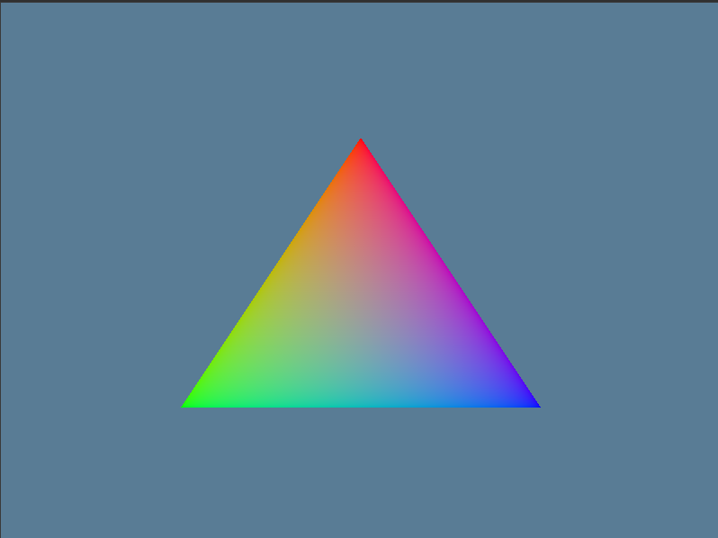

# WGPU Experiments

This repository contains experiments with the `wgpu` graphics library in Rust.

## PHASE 1: The Triangle



I'll update more details on the process soon :D

## PHASE 2: The Circle

I created a circle by using a triangle fan. A triangle fan is a series of triangles that all share a central vertex. By creating enough triangles, the shape will appear to be a circle.

The radius of the circle is calculated using the Schwarzschild radius formula, which is used to determine the radius of the event horizon of a non-rotating, uncharged black hole. The formula is `r = 2GM/c^2`, where `G` is the gravitational constant, `M` is the mass of the object, and `c` is the speed of light. In this simulation, I have used the mass of the sun to calculate the radius.

### Fitting the Circle in the Window

The Schwarzschild radius of a sun-mass black hole is approximately 2,960 meters. This is a very large value to try and fit into a small window. To solve this, I used an orthographic projection matrix. This matrix transforms the coordinates from world space to clip space. By setting the orthographic projection to have the same dimensions as the radius of the black hole, the large circle can be mapped to the small viewport of the window. This allows us to render the circle correctly, regardless of its actual size.

Here is the code that creates the projection matrix in `src/lib.rs`:

```rust
fn create_projection_matrix(width: u32, height: u32) -> Mat4 {
    let aspect_ratio = width as f32 / height as f32;
    let radius = (2.0 * G * MASS) / (C * C) * 2.0; // 200% smaller
    Mat4::orthographic_rh(
        -radius as f32 * aspect_ratio,
        radius as f32 * aspect_ratio,
        -radius as f32,
        radius as f32,
        -1.0,
        1.0,
    )
}
```

And here is the vertex shader in `src/shader.wgsl` that uses the projection matrix:

```wgsl
// uniforms.wgsl
struct Uniforms {
    projection: mat4x4<f32>,
};
@group(0) @binding(0)
var<uniform> uniforms: Uniforms;

// circle.wgsl
struct VSOut {
  @builtin(position) pos: vec4<f32>,
  @location(0) v_color: vec3<f32>,
};

@vertex
fn vs_main(
  @location(0) a_position: vec3<f32>,
  @location(1) a_color: vec3<f32>,
) -> VSOut {
  var out: VSOut;
  out.pos = uniforms.projection * vec4<f32>(a_position, 1.0);
  out.v_color = a_color;
  return out;
}
```